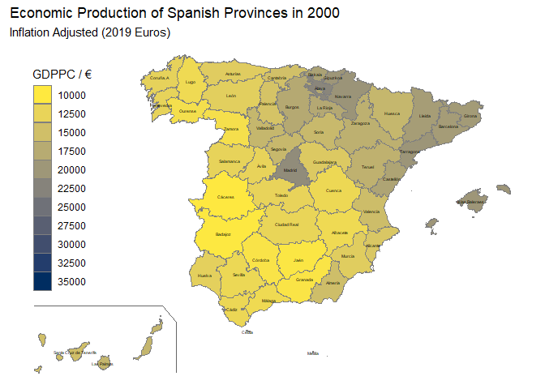
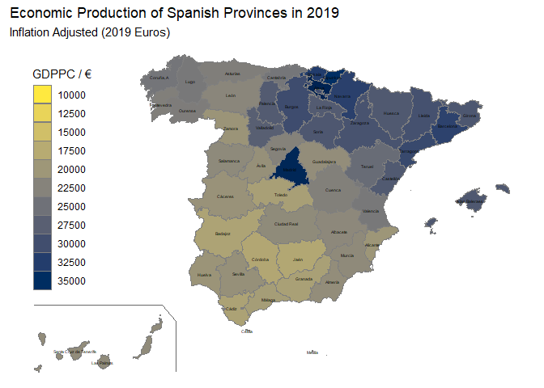
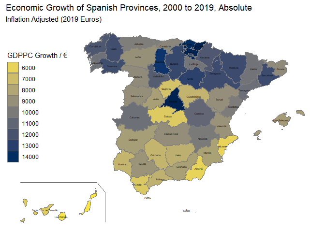

# GDP per capita of Spanish Regions

Data from the Instituto Nacional de Estadística and the Instituto
Geográfico Nacional. Euros Inflation Adjusted to 2019

------------------------------------------------------------------------

First, the 2000 and 2019 figures of GDP per capita are imported.

``` r
GDPpc_spain <- read_csv("GDP_Per_Capita_Spanish_Regions_2000_2019.csv") #Import Spanish Provinces Data
names(GDPpc_spain)[1]<-paste("provincia") # Change Province to provincia

head(GDPpc_spain, 1)
```

    ## # A tibble: 1 × 3
    ##   provincia `2000` `2019`
    ##   <chr>      <dbl>  <dbl>
    ## 1 Almería    15186  21196

The dataframe is cleaned for merging with one from mapSpain. This turned
out being unnecessary because of the mapSpain package having many
options for province names in its large dataframes.

``` r
census <- mapSpain::pobmun19

census["provincia"][census["provincia"] == "Araba/Álava"] <- "Álava" # Change alava
census["provincia"][census["provincia"] == "Balears, Illes"] <- "Islas Baleraes" # Change islas baleares
census["provincia"][census["provincia"] == "Rioja, La"] <- "La Rioja" #Change La Rioja

census["provincia"][census["provincia"] == "Alicante/Alacant"] <- "Alicante" #Change Alicante for both
GDPpc_spain["provincia"][GDPpc_spain["provincia"] == "Alicante/Alacant"] <- "Alicante" 

census["provincia"][census["provincia"] == "Castellón/Castelló"] <- "Castellón" #Change Castellón for both
GDPpc_spain["provincia"][GDPpc_spain["provincia"] == "Castellón/Castelló"] <- "Castellón" 

census["provincia"][census["provincia"] == "Valencia/València"] <- "Valencia" #Change Valencia for both
GDPpc_spain["provincia"][GDPpc_spain["provincia"] == "Valencia/València"] <- "Valencia" 

census_gdp <- merge(census,GDPpc_spain,by="provincia")
census_gdp["provincia"][census_gdp["provincia"] == "Palmas, Las"] <- "Las Palmas" #Change Las Palmas

codelist <- mapSpain::esp_codelist # Names and codes of all provinces, autonomous territories, and cities.

census_gdp_coded <- unique(merge(census_gdp, codelist[, c("cpro", "codauto")], all.x = TRUE))
names(census_gdp_coded)[8] <- "x2000" #Change 2000 to x2000 column name
names(census_gdp_coded)[9] <- "x2019" #Change 2019 to x2019 column name

census_gdp_province <- census_gdp_coded %>%
  distinct(provincia, .keep_all = TRUE) %>% #Choose unique instance of provincia
  select("cpro", "provincia", "x2000", "x2019", "codauto") #Keep useful columns


spain_sf <- esp_get_prov() # Province borders
spain_gdp_sf <- merge(spain_sf, census_gdp_province)

Can <- esp_get_can_box() # Box in bottom left corner of map
```

Four plots are made from the GDPPC data.

``` r
Provinces_2000 <-
  ggplot(spain_gdp_sf) +
  geom_sf(aes(fill = x2000),
    color = "grey50",
    lwd = .05
  ) +
  geom_sf(data = Can, color = "grey40") +
  geom_sf_label(aes(label = provincia),
    fill = "white", alpha = 0,
    size = 1.2,
    label.size = 0
  ) +
  scale_fill_gradientn(
    colors = hcl.colors(10, "Cividis", rev = TRUE),
    n.breaks = 10,
    limits = c(10000, 37000),
    guide = guide_legend(title = "GDPPC / €")
  ) +
  theme_void() +
  theme(legend.position = c(0.1, 0.6)) +
  ggtitle("Economic Production of Spanish Provinces in 2000", subtitle = "Inflation Adjusted (2019 Euros)")
Provinces_2000
```

<!-- -->

``` r
#ggsave("GDPPC_2000.png", dpi = 800)
```

``` r
Provinces_2019 <- 
  ggplot(spain_gdp_sf) +
  geom_sf(aes(fill = x2019),
    color = "grey50",
    lwd = .05
  ) +
  geom_sf(data = Can, color = "grey40") +
  geom_sf_label(aes(label = provincia),
    fill = "white", alpha = 0,
    size = 1.2,
    label.size = 0,
    colour = "black"
  ) +
  scale_fill_gradientn(
    colors = hcl.colors(10, "Cividis", rev = TRUE),
    n.breaks = 10,
    limits = c(10000, 37000),
    guide = guide_legend(title = "GDPPC / €")
  ) +
  theme_void() +
  theme(legend.position = c(0.1, 0.6)) +
  ggtitle("Economic Production of Spanish Provinces in 2019", subtitle = "Inflation Adjusted (2019 Euros)")
Provinces_2019
```

<!-- -->

``` r
#ggsave("GDPPC_2019.png", dpi = 800)
```

``` r
spain_gdp_sf <- spain_gdp_sf %>% #Create Absolute and Percent Columns
  mutate(Absolute = x2019-x2000,
         Percent = (x2019-x2000)/x2000*100)

Provinces_Absolute_Change <-
  ggplot(spain_gdp_sf) +
  geom_sf(aes(fill = Absolute),
    color = "grey50",
    lwd = .05
  ) +
  geom_sf(data = Can, color = "grey40") +
  geom_sf_label(aes(label = provincia),
    fill = "white", alpha = 0,
    size = 1.2,
    label.size = 0,
    colour = "black"
  ) +
  scale_fill_gradientn(
    colors = hcl.colors(10, "Cividis", rev = TRUE),
    n.breaks = 10,
    guide = guide_legend(title = "GDPPC Growth / €")
  ) +
  theme_void() +
  theme(legend.position = c(0.1, 0.6)) +
  ggtitle("Economic Growth of Spanish Provinces, 2000 to 2019, Absolute", subtitle = "Inflation Adjusted (2019 Euros)")
Provinces_Absolute_Change
```

<!-- -->

``` r
#ggsave("GDPPC_Absolute_Change.png", dpi = 800)
```

``` r
Provinces_Percent_Change <-
  ggplot(spain_gdp_sf) +
  geom_sf(aes(fill = Percent),
    color = "grey50",
    lwd = .05
  ) +
  geom_sf(data = Can, color = "grey40") +
  geom_sf_label(aes(label = provincia),
    fill = "white", alpha = 0,
    size = 1.2,
    label.size = 0,
    colour = "black"
  ) +
  scale_fill_gradientn(
    colors = hcl.colors(10, "Cividis", rev = TRUE),
    n.breaks = 10,
    guide = guide_legend(title = "GDPPC Growth / %")
  ) +
  theme_void() +
  theme(legend.position = c(0.1, 0.6)) +
  ggtitle("Economic Growth of Spanish Provinces, 2000 to 2019, Relative")
Provinces_Percent_Change
```

<!-- -->

``` r
#ggsave("GDPPC_Percent_Change.png", dpi = 800)
```

An animation is made shocasing the absolute change in GDPPC for each
province from 2000 to 2019.

``` r
long_spain_gdp_sf <- # Making a "Year" column where each province has 2000 and 2019
  spain_gdp_sf %>%
  pivot_longer(
    cols = starts_with("x"), 
    names_to = "year",
    names_prefix = "x",
    names_transform = list(year = as.integer),
    values_to = "GDPPC",
  )

Provinces_2000_2019 <-
  ggplot(long_spain_gdp_sf) +
  geom_sf(aes(fill = GDPPC),
    color = "grey50",
    lwd = .05
  ) +
  geom_sf(data = Can, color = "grey40") +
  geom_sf_label(aes(label = provincia),
    fill = "white", alpha = 0,
    size = 1.2,
    label.size = 0
  ) +
  scale_fill_gradientn(
    colors = hcl.colors(10, "Cividis", rev = TRUE),
    n.breaks = 10,
    limits = c(10000, 37000),
    guide = guide_legend(title = "GDPPC / €")
  ) +
  theme_void() +
  theme(legend.position = c(0.1, 0.6)) +
  ggtitle("Economic Production of Spanish Provinces Transition from 2000 to 2019", subtitle = "Inflation Adjusted (2019 Euros)") +
  transition_states(year, wrap=FALSE)

animate(
  Provinces_2000_2019,
  width = 1360, height = 840, res=300,
  renderer = gifski_renderer()
)
```

<!-- -->

``` r
anim_save("Provinces_2000_2019_Transition.gif", animation = last_animation())
```
